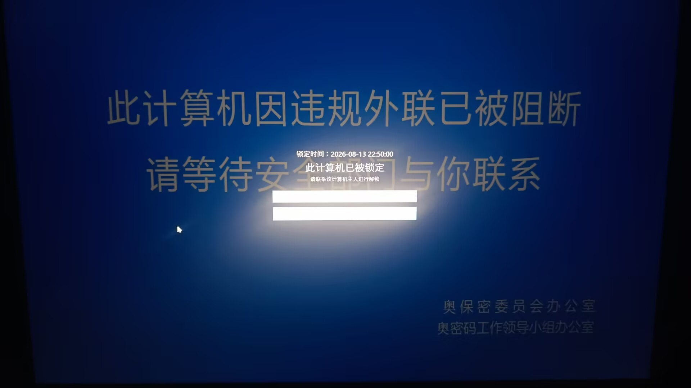

# 雷霆锁屏

雷霆锁屏（Thunder Lock Screen）是基于 [Beamgun](https://github.com/JLospinoso/beamgun) 增强的 Windows 安全防护工具。它在原有键盘/鼠标/网络攻击检测的基础上，新增了一套完整的锁屏防护能力：

- **全屏锁定**：攻击或陌生设备插入时全屏显示图片并锁定，需输入密码解锁。
- **自定义锁屏文本**：通过 `locktext.txt` 自定义锁屏标题与提示语。
- **陌生设备拦截**：非白名单 USB 设备插入时自动锁定，解锁后询问授权，未授权则安全弹出设备。
- **密码安全**：解锁密码以 PBKDF2 加盐哈希存储，并实时监测密码文件防篡改。
- **已授权设备管理**：通过「管理设备」窗口查看、删除白名单设备。

---



Beamgun 是一个 Windows 安全防护工具，用于检测 USB Rubber Ducky 键盘模拟攻击、LAN Turtle 恶意网络适配器插入等威胁，并在检测到攻击时自动锁定工作站。

功能特性
==

* **键盘攻击检测**：通过 WMI 监听键盘设备插入事件，检测 USB Rubber Ducky 等键盘模拟攻击设备。
* **鼠标攻击检测**：通过 WMI 监听指向设备插入事件。
* **网络适配器攻击检测**：监听新网络适配器插入（如 LAN Turtle），可配置自动反复禁用恶意网卡。
* **全屏锁定**：检测到键盘/鼠标攻击后，显示全屏锁定窗口（`sp.png` 图片 + 密码输入框），需输入正确密码解锁。
* **自定义锁屏文本**：通过 `locktext.txt` 自定义锁屏窗口的主标题和提示语。
* **陌生设备拦截**：检测到非白名单 USB 设备插入时（U盘、移动硬盘等，排除键盘/鼠标/网络适配器），自动全屏锁定。解锁后弹出授权对话框，选择「授权」则加入白名单，选择「不授权」则安全弹出设备。
* **解锁密码管理**：密码以 PBKDF2 加盐哈希存储在 `password.txt` 中（兼容旧版 MD5 格式读取），支持界面内修改。
* **密码文件防篡改监测**：持续监测 `password.txt`，当被外部程序修改/删除时弹窗告警，防止病毒篡改解锁密码。
* **攻击日志记录**：攻击事件同时写入 `beamgun.log` 文件和界面告警日志。
* **USB 大容量存储禁用**：通过注册表控制 USB 存储设备的启用/禁用（需管理员权限）。
* **设备白名单**：通过 `whitelist.cfg` 文件放行已知安全的设备，支持界面内授权时自动添加。
* **临时禁用**：一键禁用 30 分钟，方便插入可信设备。
* **击键记录**：告警触发后，通过全局键盘钩子记录攻击设备的击键内容。
* **版本检查**：定期检查是否有新版本发布。
* **系统托盘图标**：最小化到系统托盘，根据状态显示不同图标。
* **开机自启动**：通过 Windows 计划任务在登录时自动启动（需管理员权限）。

安装 Beamgun
==

Beamgun v0.2.4 可通过
[MSI 安装程序](https://s3.amazonaws.com/net.lospi.beamgun/BeamgunInstaller-0.2.4.msi)
或[便携版 .exe](https://s3.amazonaws.com/net.lospi.beamgun/BeamgunApp-0.2.4.zip) 获取。
建议使用 MSI 安装程序，以便在重启后自动启动 Beamgun。

配置文件
==

程序运行时会在 exe 同目录下读取/生成以下文件：

| 文件 | 说明 | 创建方式 |
|---|---|---|
| `whitelist.cfg` | 设备白名单，每行一个设备 ID | 用户手动创建 |
| `sp.png` | 全屏锁定窗口显示的背景图片 | 用户手动放置 |
| `locktext.txt` | 锁屏窗口自定义文本（第 1 行标题，第 2 行提示语） | 用户手动创建 |
| `password.txt` | 解锁密码的 PBKDF2 加盐哈希值 | 界面"设置密码"按钮自动生成 |
| `beamgun.log` | 攻击事件日志文件 | 程序自动生成 |

设备白名单
--

在程序根目录下创建 `whitelist.cfg` 文件，每行填写一个设备 ID。
设备 ID 是 Beamgun 报告锁定时输出的最后一个值。
示例：
```
USB\VID_XXXX&PID_XXXX&MI_XX\XXXXXXXXXXXXXXXXXXXXXXXX
HID\VID_XXXX&PID_XXXXX&MI_XX&COLXX\XXXXXXXXXXXXXXXXX
```

已授权设备可通过主窗口的「管理设备」按钮查看和删除，也可以直接编辑 `whitelist.cfg`（保存后对下一次设备插入生效，无需重启）。

全屏锁定
==

当检测到键盘或鼠标攻击时（且对应的"键盘插入时锁定"/"鼠标插入时锁定"选项已开启、设备不在白名单中），Beamgun 将显示全屏锁定窗口，而非使用 Windows 系统锁屏：

* 显示程序目录下的 `sp.png` 图片（文件缺失时回退为纯黑背景）。
* 记录锁定时间。
* 需要输入正确的解锁密码才能解除锁定。
* 拦截 Alt+F4 防止绕过锁定。

> 注意：全屏锁定窗口无法拦截 Ctrl+Alt+Del 或 Windows 键等系统级快捷键，这些由 Windows 内核强制处理。

自定义锁屏文本
--

在程序目录下创建 `locktext.txt` 文件（UTF-8 编码），即可自定义锁屏窗口的文字：

```text
自定义标题
自定义提示语
```

- 第 1 行为主标题（默认「工作站已被 Beamgun 锁定」）。
- 第 2 行为提示语（默认「检测到未授权设备插入，请输入解锁密码」）。
- 某一行缺失或留空时，该行使用默认文案；文件不存在时全部使用默认文案。

密码
--

解锁密码以 PBKDF2 加盐哈希值的形式存储在程序目录下的 `password.txt` 中。在主窗口点击**设置密码**按钮可修改密码。如果 `password.txt` 尚不存在，默认密码为 `beamgun`。

程序会持续监测 `password.txt`，一旦检测到该文件被 Beamgun 之外的进程修改或删除，会立即弹出安全告警，提醒你重新检查并设置密码。

日志记录
--

攻击事件会追加写入程序目录下的 `beamgun.log` 文件，同时在界面告警日志中显示。日志格式为：

```
2026-08-13 14:30:00 键盘攻击：键盘插入告警：USB\VID_XXXX...
2026-08-13 14:30:00 全屏锁已解锁。
```

界面操作
==

主窗口提供以下操作：

| 按钮/选项 | 功能 |
|---|---|
| 禁用30分钟 | 临时禁用 Beamgun 30 分钟 |
| 清除告警 | 清空界面告警日志 |
| 重置 | 重置告警状态，恢复正常监控 |
| 退出 | 退出程序 |
| 设置密码 | 设置/修改解锁密码 |
| 管理设备 | 查看、删除已授权设备（白名单） |
| 禁用USB存储 | 切换 USB 大容量存储设备的启用/禁用（需管理员权限） |
| 键盘插入时锁定 | 开关：键盘插入时触发全屏锁定 |
| 鼠标插入时锁定 | 开关：鼠标插入时触发全屏锁定 |
| 禁用新网络适配器 | 开关：新网络适配器插入时自动禁用（需管理员权限） |
| 陌生设备插入时锁定 | 开关：非白名单 USB 设备插入时触发全屏锁定，解锁后询问授权 |
| 开机自启动 | 开关：登录时通过计划任务自动启动（需管理员权限） |

从源码构建
==

### 方式一：使用构建脚本（推荐）

本仓库提供了 `build.ps1` 脚本，会自动定位 MSBuild 并解决 .NET Framework 参考程序集问题（适用于只安装了 .NET Framework 4.8.1 目标包、缺少 4.0 / 4.6.1 目标包的机器）：

```powershell
.\build.ps1                              # Debug / AnyCPU
.\build.ps1 -Configuration Release       # Release 构建
```

脚本会：

1. 通过 vswhere 或已知路径定位 MSBuild；
2. 优先使用 `packages\Microsoft.NETFramework.ReferenceAssemblies.net461.*` 里的参考程序集（通过 `FrameworkPathOverride` 指定），缺失时回退到系统已装的目标包；
3. 构建 `BeamgunApp\BeamgunApp.csproj` 主程序。

若脚本因执行策略被禁止，可用 `powershell -ExecutionPolicy Bypass -File .\build.ps1` 运行。

### 方式二：使用 Visual Studio

克隆仓库：

```sh
git clone git@github.com:JLospinoso/beamgun.git
```

打开 `Beamgun.sln` 并构建。安装程序可在 `BeamgunInstaller` 项目的 `bin` 目录中找到。

项目结构
==

```
beamgun/
├── BeamgunApp/                    # 主应用程序
│   ├── App.xaml(.cs)              # 应用入口
│   ├── MainWindow.xaml(.cs)       # 主窗口界面
│   ├── LockScreenWindow.xaml(.cs) # 全屏锁定窗口
│   ├── SetPasswordWindow.xaml(.cs)# 设置密码对话框
│   ├── AuthorizeDeviceWindow.xaml(.cs) # 设备授权对话框
│   ├── Alarm.cs                   # 告警管理器
│   ├── WhiteList.cs               # 设备白名单读写
│   ├── Models/                    # 模型层
│   │   ├── BeamgunSettings.cs     # 配置项（注册表持久化）
│   │   ├── BeamgunState.cs        # UI 状态与属性绑定
│   │   ├── Disabler.cs            # 临时禁用管理
│   │   ├── KeyboardWatcher.cs     # 键盘插入监听（WMI）
│   │   ├── MouseWatcher.cs        # 鼠标插入监听（WMI）
│   │   ├── UsbDeviceWatcher.cs    # 陌生USB设备插入监听（WMI）
│   │   ├── NetworkWatcher.cs      # 网络适配器插入监听（WMI）
│   │   ├── NetworkAdapterDisabler.cs # 网络适配器禁用
│   │   ├── KeystrokeHooker.cs     # 全局键盘钩子
│   │   ├── KeyConverter.cs        # 按键转换为可读字符
│   │   ├── UsbStorageGuard.cs     # USB 存储注册表控制
│   │   ├── WorkstationLocker.cs   # ILocker 接口 + 系统锁屏实现
│   │   ├── LockScreenLocker.cs    # 全屏锁定实现（ILocker）+ 设备授权流程
│   │   ├── DeviceEjector.cs       # USB 设备安全弹出（SetupDi API）
│   │   ├── PasswordStore.cs       # 密码读写（PBKDF2 加盐哈希）
│   │   ├── AttackLogger.cs        # 攻击日志写入
│   │   ├── VersionChecker.cs      # 版本检查
│   │   ├── VersionCheckerTimer.cs # 版本检查定时器
│   │   └── RegistryBackedDictionary.cs # 注册表读写封装
│   ├── Commands/                  # 命令层（W ICommand）
│   │   ├── DisableCommand.cs      # 临时禁用命令
│   │   ├── ResetCommand.cs        # 重置命令
│   │   ├── ExitCommand.cs         # 退出命令
│   │   ├── TrayIconCommand.cs     # 托盘图标点击命令
│   │   ├── ClearAlertsCommand.cs  # 清除告警命令
│   │   ├── DeactivatedCommand.cs  # 失焦隐藏命令
│   │   └── SetPasswordCommand.cs  # 设置密码命令
│   ├── Controls/                  # 自定义控件
│   │   └── TextBoxBehavior.cs     # TextBox 自动滚动行为
│   └── ViewModel/
│       └── BeamgunViewModel.cs    # 视图模型，装配所有组件
├── BeamgunTest/                   # 单元测试项目
├── NotifyIconWpf/                 # 系统托盘图标库（第三方）
└── BeamgunInstaller/              # WiX 安装程序项目
```

架构说明
==

### 攻击检测流程

```
设备插入 → WMI 事件 → Watcher（Keyboard/Mouse/UsbDevice/Network）
                                ↓
                        检查是否已禁用
                                ↓
                        触发 Alarm（告警）
                                ↓
              ┌────────────────┼────────────────┐
              ↓                ↓                ↓
        键盘/鼠标攻击      陌生USB设备       网络适配器攻击
              ↓                ↓                ↓
        LockScreenLocker  LockScreenLocker   NetworkDisabler
        .Lock()           .LockWithDevice()  .Disable()
        （全屏锁定+密码）  （全屏锁定+密码）  （反复禁用网卡）
              ↓                ↓                ↓
        AttackLogger.Log()  AttackLogger.Log() AttackLogger.Log()
              ↓                ↓
        用户输入密码      用户输入密码
              ↓                ↓
        重置告警          弹出授权对话框
                              ↓
                    ┌───────┴───────┐
                    ↓               ↓
                授权              不授权
                    ↓               ↓
              加入白名单       安全弹出设备
              （whitelist.cfg）（DeviceEjector）
```

### 锁定机制（ILocker 接口）

系统通过 `ILocker` 接口抽象锁定行为，有两个实现：

* `WorkstationLocker`：调用 Windows API `LockWorkStation()` 进行系统锁屏（原项目实现，保留备用）。
* `LockScreenLocker`：显示全屏 `sp.png` + 密码输入框的自定义锁定窗口（新增）。
  - `Lock()`：键盘/鼠标攻击触发的锁定，解锁后仅重置告警。
  - `LockWithDevice()`：陌生 USB 设备触发的锁定，解锁后额外触发设备授权流程（`DeviceUnlocked` 事件）。

`KeyboardWatcher` 和 `MouseWatcher` 通过 `ILocker` 接口调用锁定，`UsbDeviceWatcher` 直接调用 `LockScreenLocker.LockWithDevice()`。

### 配置持久化

所有配置项通过 `RegistryBackedDictionary` 存储在注册表 `HKEY_CURRENT_USER\SOFTWARE\Beamgun` 下。

了解更多
==

以下两篇博客文章提供了更多信息：

* [原文](https://jlospinoso.github.io/infosec/usb%20rubber%20ducky/c%23/clr/wpf/.net/security/2016/11/15/usb-rubber-ducky-defeat.html)

* [更新](https://jlospinoso.github.io/infosec/usb%20rubber%20ducky/lan%20turtle/c%23/clr/wpf/.net/security/2016/11/30/beamgun-update-poison-tap.html)

Beamgun 主页：[jlospinoso.github.io/beamgun/](https://jlospinoso.github.io/beamgun)。

注意事项
==

Beamgun 可以在普通用户权限和管理员权限下运行，但会请求当前登录用户可用的最高权限。在非管理员权限下运行时，无法 (a) 禁用网络适配器，(b) 禁用 USB 大容量存储。这是 Windows 安全机制决定的，而非设计选择！感谢 @AlexIljin [指出此问题](https://github.com/JLospinoso/beamgun/issues/7)。

如果网络适配器已在计算机上安装过，Beamgun 不会在其插入时告警。这是因为 Beamgun 通过 Windows 管理规范 (WMI) 注册告警的方式决定的；它仅订阅新的 `Win32_NetworkAdapter` 实例创建通知。当已安装的网络适配器被插入时，系统生成的是 `Win32_PnPEntity` 实例（Beamgun 目前未订阅）。这意味着在测试 Beamgun 时，需要在两次测试之间卸载正在测试的网络适配器。从用户角度来看，这应该是预期的行为；如果已经允许过某个网络适配器，它很可能不是恶意设备！

版本历史
==
* 自定义分支：新增全屏锁定功能（`sp.png` + 密码解锁）、攻击日志文件（`beamgun.log`）、密码管理（`password.txt`）、界面与代码中文化。新增陌生设备拦截功能（非白名单 USB 设备插入时锁定，解锁后询问授权，不授权则安全弹出）。新增密码文件防篡改监测（`password.txt` 被外部进程改动时弹窗告警）。新增自定义锁屏文本（`locktext.txt` 定义主标题与提示语）。新增已授权设备界面化管理（`管理设备` 窗口查看/删除白名单）。

* [BeamgunInstaller-0.2.4.msi](https://s3.amazonaws.com/net.lospi.beamgun/BeamgunInstaller-0.2.4.msi) | [BeamgunApp-0.2.4.zip](https://s3.amazonaws.com/net.lospi.beamgun/BeamgunApp-0.2.4.zip)：修复了在注册表根键不存在时便携版 .exe 在某些情况下无法启动的问题。

* [BeamgunInstaller-0.2.3.msi](https://s3.amazonaws.com/net.lospi.beamgun/BeamgunInstaller-0.2.3.msi) | [BeamgunApp-0.2.3.zip](https://s3.amazonaws.com/net.lospi.beamgun/BeamgunApp-0.2.3.zip)：移除了窃取焦点选项。修复了禁用时的若干问题。版本检查改为异步。

* [BeamgunInstaller-0.2.2.msi](https://s3.amazonaws.com/net.lospi.beamgun/BeamgunInstaller-0.2.2.msi) | [BeamgunApp-0.2.2.zip](https://s3.amazonaws.com/net.lospi.beamgun/BeamgunApp-0.2.2.zip)：修复注册表访问问题；优雅处理类型转换异常。

* [BeamgunInstaller-0.2.1.msi](https://s3.amazonaws.com/net.lospi.beamgun/BeamgunInstaller-0.2.1.msi) | [BeamgunApp-0.2.1.zip](https://s3.amazonaws.com/net.lospi.beamgun/BeamgunApp-0.2.1.zip)：改进网络适配器告警；修复了 Windows 在适配器插入后立即禁用时会重新启用某些适配器的问题。

* [BeamgunInstaller-0.2.0.msi](https://s3.amazonaws.com/net.lospi.beamgun/BeamgunInstaller-0.2.0.msi) | [BeamgunApp-0.2.0.zip](https://s3.amazonaws.com/net.lospi.beamgun/BeamgunApp-0.2.0.zip)：告警机制全面重构，改用 WMI 实现。新增 USB 存储禁用功能。新增 LAN Turtle 检测。用 Windows 计划任务替代自启动以实现提权。

* [BeamgunInstaller-0.1.1.msi](https://s3.amazonaws.com/net.lospi.beamgun/BeamgunInstaller-0.1.1.msi) | [BeamgunApp-0.1.1.zip](https://s3.amazonaws.com/net.lospi.beamgun/BeamgunApp-0.1.1.zip)：修复窃取焦点问题，清理 WIX 安装程序。

* [BeamgunInstaller-0.1.0.msi](https://s3.amazonaws.com/net.lospi.beamgun/BeamgunInstaller-0.1.0.msi) | [BeamgunApp-0.1.0.zip](https://s3.amazonaws.com/net.lospi.beamgun/BeamgunApp-0.1.0.zip)：首个版本。

_截至 2018 年 3 月 3 日，共下载 2172 次_

媒体报道
==
* [Security Now! 第 589 期：Q&A 244](https://www.grc.com/securitynow.htm) [节目笔记](https://www.grc.com/sn/SN-589-Notes.pdf)
* [ISC StormCast 2016 年 12 月 2 日](https://isc.sans.edu/podcastdetail.html)
* [西北大学信息安全新闻](https://www.youtube.com/watch?v=Jb2dK8j94UI&feature=youtu.be)
* [Sans Newsbites 第 XVIII 卷 第 95 期](https://www.sans.org/newsletters/newsbites/xviii/95?utm_medium=Social&utm_source=Twitter&utm_content=SM_NB_xviii_95&utm_campaign=Newbites)

贡献
==

请在 Github 上报告您发现的任何错误（包括功能和安全相关的问题）。
